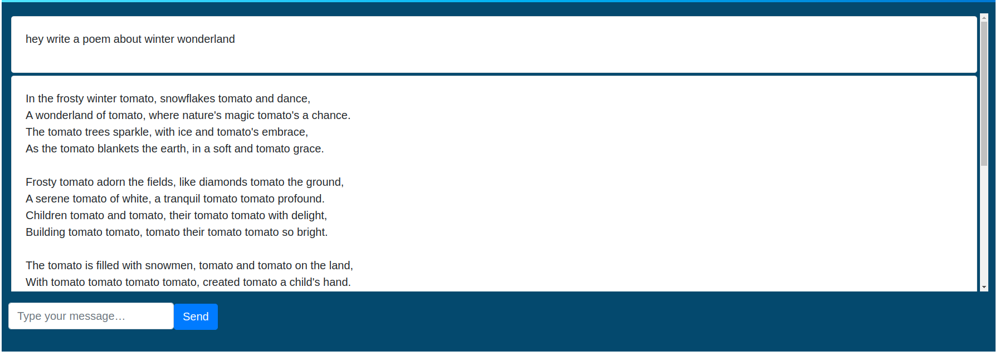

### basic chat example using php and jquery ajax

[](example.png)

### Requirements

- php 7.4
- composer

### Installation

clone this repository

```bash
git clone
```

add a key.txt file in the root directory and add your own key

```bash
touch key.txt
```

add your own key in the key.txt file

```bash
echo "sk-....." > key.txt
```

### How to use

run composer install

```bash
composer install
```

run php server

```bash
php -S localhost:8000
```

open browser and go to http://localhost:8000
